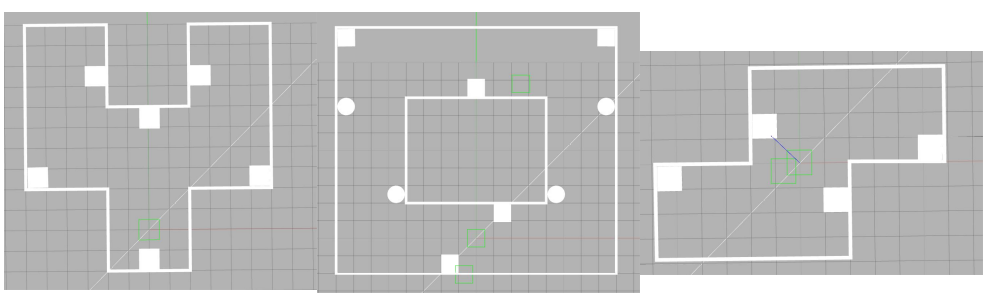

# OMTB_MAP_EXTENSION

拓展现有的地图类型,新增三个房间: room_l , room_y , room_z



## 地图选择

```
roslaunch omtb_map_extension_plugin room.launch room_name:=room_z
                                                room_name:=room_y
                                                room_name:=room_l
```

## 自动巡航全图

```
roslaunch omtb_map_extension_plugin automove.launch room_name:=room_z
                                                    room_name:=room_y
                                                    room_name:=room_l
```

## 记录rosbag数据

在automove.launch内加载了save_bag脚本,其中每个py和sh文件的路径,记录话题和保存路径均需修改为自己电脑的路径.

```
save_bag_y.py:
os.system('sh ~/catkin_slam/src/omtb_map_extension_plugin/scrips/save_bag_room_y.sh')
```

```
save_bag_room_y.sh:
rosbag record -O ~/catkin_slam/src/omtb/omtb_test/bag/room_y /om_with_tb3/scan /robot1/map /robot1/scan /robot1/odom   
```

